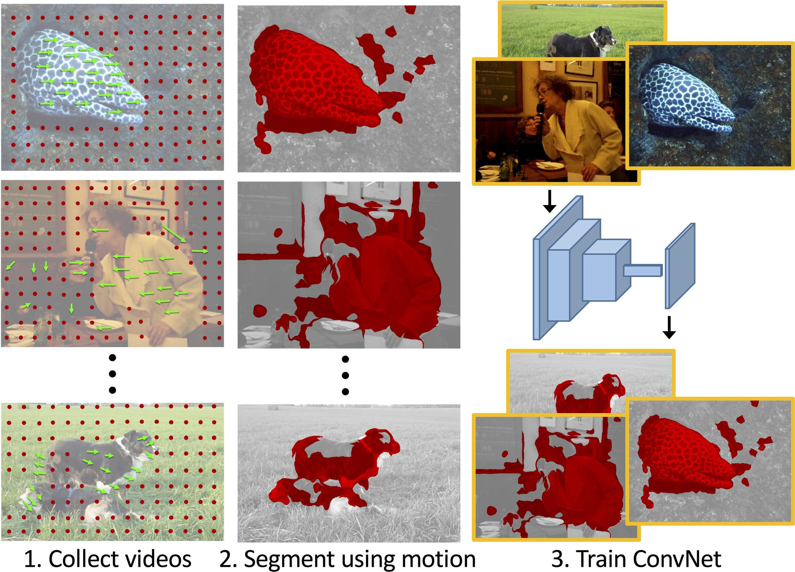

## Learning Features by Watching Objects Move ##
In CVPR 2017. [[Project Website]](http://cs.berkeley.edu/~pathak/unsupervised_video/).

[Deepak Pathak](https://people.eecs.berkeley.edu/~pathak/), [Ross Girshick](http://www.rossgirshick.info/), [Piotr Doll&aacute;r](https://pdollar.github.io/), [Trevor Darrell](https://people.eecs.berkeley.edu/~trevor/), [Bharath Hariharan](http://home.bharathh.info/)<br/>
University of California, Berkeley<br/>
Facebook AI Research (FAIR)<br/>



This is the code for our [CVPR 2017 paper on Unsupervised Learning using unlabelled videos](http://cs.berkeley.edu/~pathak/unsupervised_video/). This repo contains models trained by the unsupervised motion grouping algorithm both in Caffe and Torch. If you find this work useful in your research, please cite:

    @inproceedings{pathakCVPR16context,
        Author = {Pathak, Deepak and Girshick, Ross and Doll\'{a}r, Piotr and Darrell, Trevor and Hariharan, Bharath},
        Title = {Learning Features by Watching Objects Move},
        Booktitle = {Computer Vision and Pattern Recognition ({CVPR})},
        Year = {2017}
    }

### 1) Fetching Models

1. Clone the repository
  ```Shell
  git clone https://github.com/pathak22/unsupervised-video.git
  ```

2. Fetch caffe models
  ```Shell
  cd unsupervised-video/
  bash ./models/download_caffe_models.sh
  # This will populate the `./models/` folder with trained models.
  ```

3. Fetch torch models
  ```Shell
  cd unsupervised-video/
  bash ./models/download_torch_models.sh
  # This will populate the `./models/` folder with trained models.
  ```

### 2) Additional Software Packages

We are releasing software packages which were developed in the project, but could be generally useful for computer vision research. If you find them useful, please consider citing our work. These include:

(a) <a href='https://github.com/pathak22/videoseg'><b>uNLC [github]</b></a>: Implementation of unsupervised bottom-up video segmentation algorithm which is unsupervised adaptation of NLC algorithm by Faktor and Irani, BMVC 2014. For additional details, see section 5.1 in the <a href="http://cs.berkeley.edu/~pathak/papers/cvpr17.pdf">paper</a>.<br/><br/>
(b) <a href='https://github.com/pathak22/pyflow'><b>PyFlow [github]</b></a>: This is python wrapper around Ce Liu's <a href="http://people.csail.mit.edu/celiu/OpticalFlow/">C++ implementation</a> of Coarse2Fine Optical Flow. This is used inside uNLC implementation, and also generally useful as an independent package.
